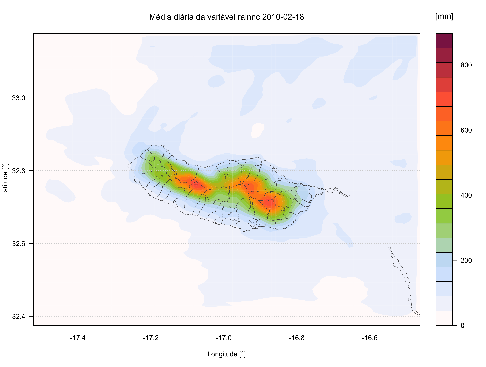
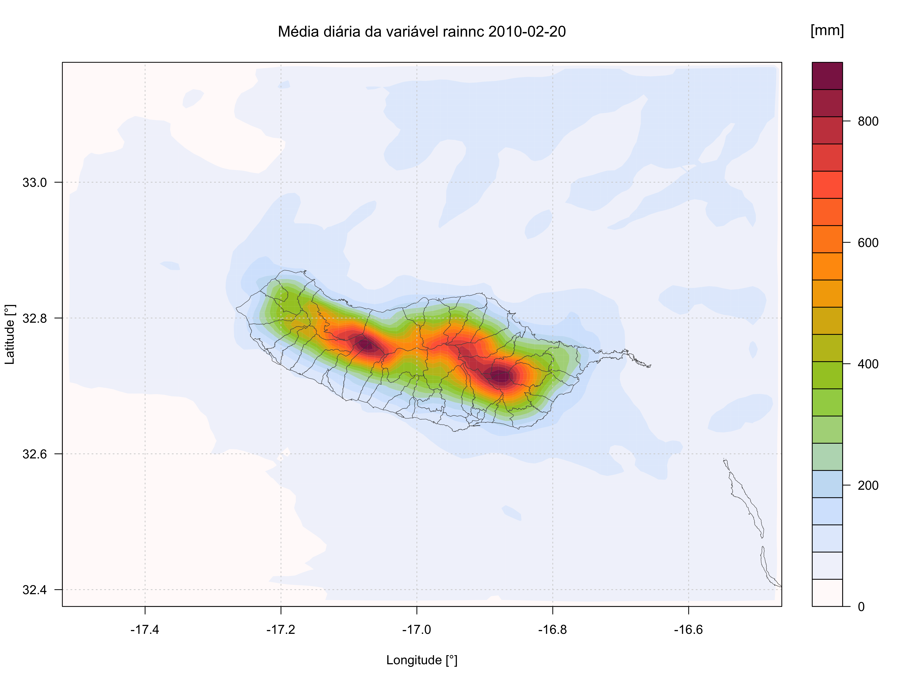
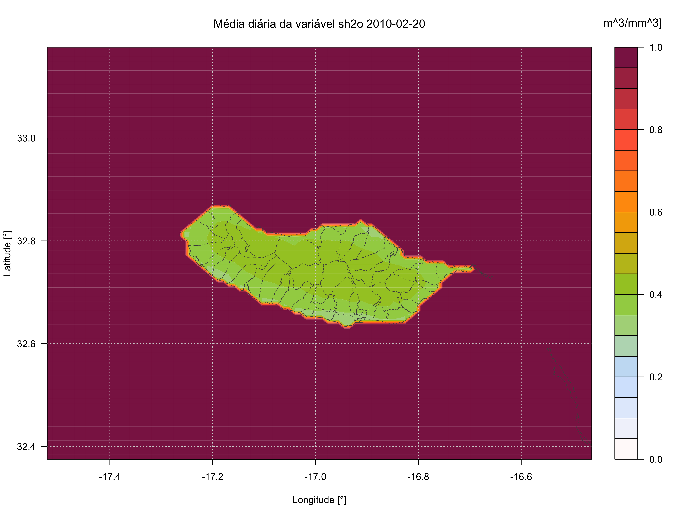
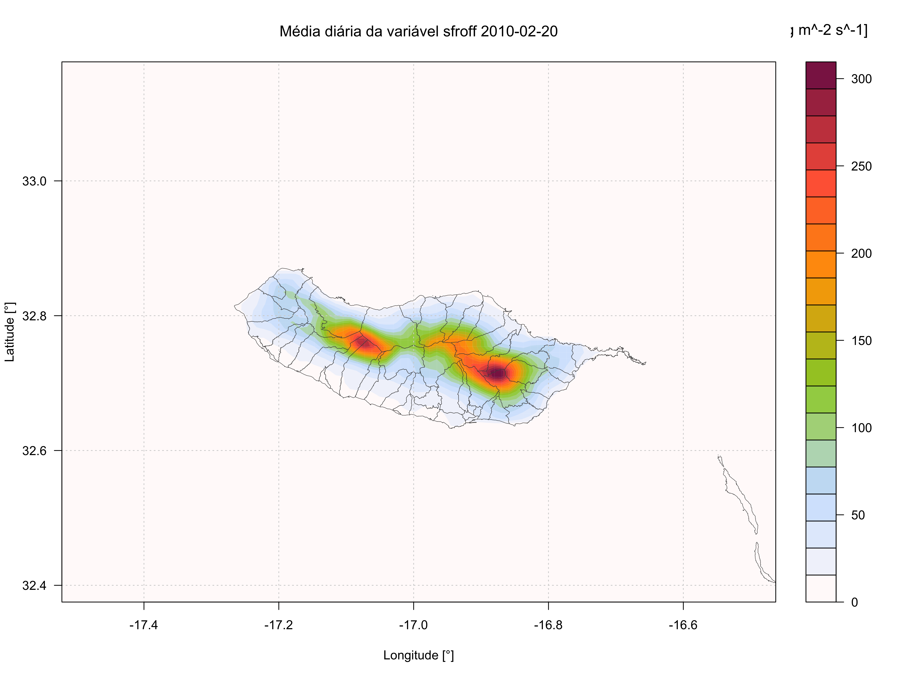
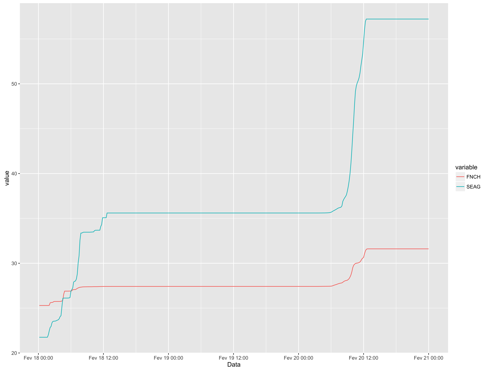
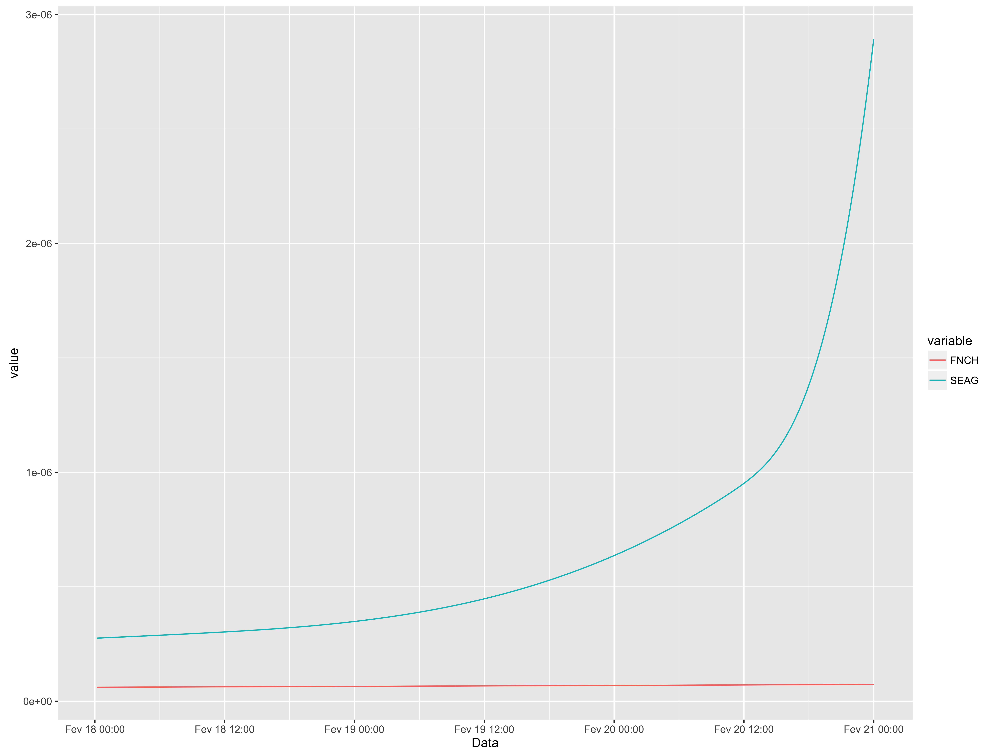

# WRF output for hydrology analysis
Creates statistical data with the results of the WRF simulations, over WRF simulated area and desired number off stations with coordinates location.

This tool is used to have a critical analysis over the WRF with hydrology outputs results, so user can study the hydrology in that particular area.

Work in progress!!!

**To implement:**

* Compare data obtained from Stations and WRF simulation

## Results:
**(example of 20 feb 2010 storm in Madeira modelated in WRF, images and graphs from 2 location with respective coordinates, FNCH (Funchal) & SEAG (Serra de Água))**


* Max hourly precipitation rate "RAINNC"





* Liquid soil moisture "SH2O"



* Surface runoff "SFROFF"



* Subsurface runoff "UDROFF"



## Usage:

* Run:
```r
make run
```

* kill application:
```r
make kill
```

Contacts:

<ricardo88faria@gmail.com>
